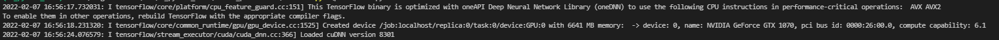

# WP_python_ws21
Uni Project WS21

## What is the goal?
Ziel dieses Projektes war die Konzeptionierung und Implementation eines Aktienprognose-Programms. Dazu genutzt werden sollen neurale Netze, die basierend auf der vergangenen Entwicklung der Aktie den weiteren Verlauf prognostizieren. Es wird dazu außerdem ein Frontend angeboten, dass die Ergebnisse als Graphen visualisiert und eine neue Generierung mit konfigurierbaren Parametern zulässt.

## Installation 
pip install -r .\requirements.txt

### NVIDIA CUDA
Um die Verarbeitung erheblich zu beschleunigen wird, wenn möglich, empfohlen die CUDA Umgebung für NVIDIA Grafikkarten zu installieren. Bitte dafür die hier aufgeführten Dependencies installieren:
https://www.tensorflow.org/install/gpu#software_requirements

- Woher weiß ich, dass die Installation erfolgreich war und meine Berechnung jetzt sehr viel schneller ist?
Erfolg:

  
### GUI
  - tkinter
  - plotly 

### Stock Info

Stock info is based on the Nasdaq Stock Exchange in NYC.

## Sources

- Vorhersage wurde basiert auf Tutorial gefunden unter: https://www.thepythoncode.com/article/stock-price-prediction-in-python-using-tensorflow-2-and-keras ( Parameter wurden optimiert und der Code umstrukturiert + erweitert)
- Verständnis und Umstrukturierung hat natürlich noch tensorflow Verständnis vorausgesetzt: https://www.tensorflow.org/api_docs/python/tf/keras
- Die Visualisierung wurde mithilfe der Plotly Doku umgesetzt: https://plotly.com/python/candlestick-charts/